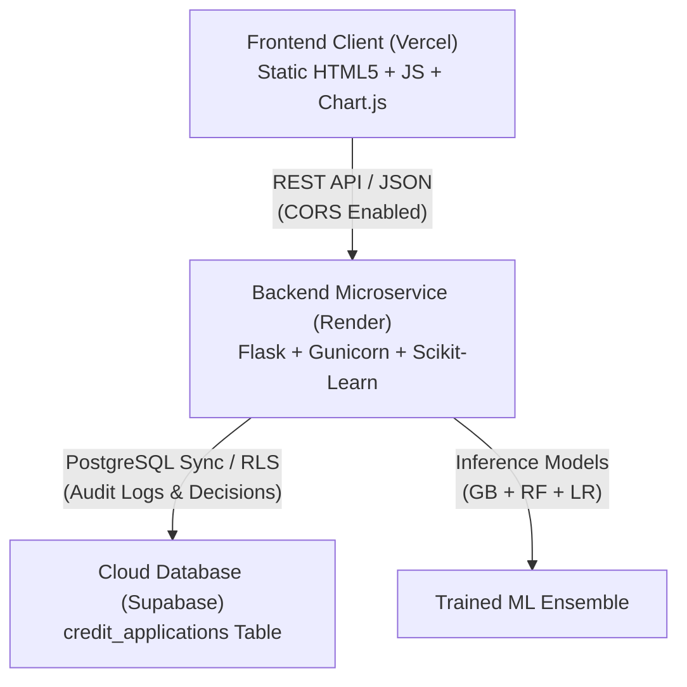

# 🚀 CrediPulse AI &mdash; Live Production Deployment Guide

A complete, step-by-step walkthrough for taking **CrediPulse AI (Credit Scoring Engine)** live across **Vercel (Frontend)**, **Render (Backend)**, and **Supabase (PostgreSQL Database)**.

---

## 🏗️ Architecture Overview



---

## Part 1: Supabase Database Setup (Database Layer)

1. **Create a Free Supabase Project**:
   - Go to [Supabase](https://supabase.com/) and click **Start your project** / **Sign In**.
   - Click **New Project**, select an organization, name it `credipulse-db`, and choose a secure database password and region.
   - Wait ~1-2 minutes for the database to provision.

2. **Run the Database Migration Script**:
   - In your Supabase project dashboard, open the **SQL Editor** (left navigation).
   - Click **New Query**.
   - Copy and paste the entire contents of [`supabase_schema.sql`](supabase_schema.sql).
   - Click **Run** (or `Ctrl + Enter`).
   - You will see the confirmation: `Success. No rows returned`.

3. **Obtain API Keys & URL**:
   - Go to **Project Settings** (gear icon at bottom left) &rarr; **API**.
   - Copy your **Project URL** (e.g. `https://xyzproject.supabase.co`).
   - Copy your **`anon` `public` Key** (or `service_role` key).
   - Keep these values ready for Part 2!

---

## Part 2: Render Backend Deployment (Backend Layer)

1. **Push Changes to GitHub**:
   - Make sure your latest code is pushed to your GitHub repository:
     ```bash
     git add .
     git commit -m "Configure live deployment for Vercel, Render, and Supabase"
     git push origin main
     ```

2. **Create Web Service on Render**:
   - Sign in to [Render Dashboard](https://dashboard.render.com/).
   - Click **New +** &rarr; **Web Service**.
   - Connect your GitHub repository: `Nitishkumarjsr/Credit-Scoring-Model` (or select public Git repo).
   - Configure the following settings:
     - **Name**: `credit-scoring-backend`
     - **Region**: `Oregon (US West)` or nearest to your users
     - **Branch**: `main`
     - **Root Directory**: Leave blank (or `.`)
     - **Runtime**: `Python 3`
     - **Build Command**: `pip install -r requirements.txt`
     - **Start Command**: `gunicorn app:app --bind 0.0.0.0:$PORT --workers 2 --threads 4 --timeout 120`
     - **Instance Type**: `Free`

3. **Add Environment Variables in Render**:
   - In the **Environment Variables** section, add:
     - `PYTHON_VERSION`: `3.11.8`
     - `SUPABASE_URL`: `https://your-project-id.supabase.co`
     - `SUPABASE_KEY`: `your-supabase-anon-key`
     - `PORT`: `10000`

4. **Deploy**:
   - Click **Create Web Service**.
   - Render will build dependencies and start the Gunicorn server.
   - Once deployment completes, your backend URL will be live at:
     `https://credit-scoring-backend.onrender.com` (or similar).
   - Verify health: Open `https://<your-backend-url>.onrender.com/health` in your browser. You should see `{"status": "healthy"}`.

> [!NOTE]
> Render Free tier web services spin down after 15 minutes of inactivity. When a new request arrives, it takes ~45-50 seconds to spin up. The CrediPulse frontend automatically detects this and shows an amber status pill while warming up.

---

## Part 3: Vercel Frontend Deployment (Frontend Layer)

1. **Deploy to Vercel**:
   - Sign in to [Vercel](https://vercel.com/).
   - Click **Add New...** &rarr; **Project**.
   - Import your GitHub repository: `Nitishkumarjsr/Credit-Scoring-Model`.
   - In the **Configure Project** screen:
     - **Framework Preset**: `Other`
     - **Root Directory**: Click `Edit` and select `frontend` (or leave as root `/` &mdash; both are configured with `vercel.json`).
     - **Build Command**: None (leave empty)
     - **Output Directory**: None (leave empty)
   - Click **Deploy**.

2. **Configure Backend URL in the Live Web App**:
   - Once Vercel finishes deploying, visit your live Vercel URL (e.g., `https://credipulse-ai.vercel.app`).
   - Click the **Settings** button in the top navbar.
   - Paste your Render Backend URL (e.g., `https://credit-scoring-backend.onrender.com`).
   - Click **Test Ping** &rarr; Verify green confirmation badge.
   - Click **Save & Connect**.

---

## Part 4: End-to-End Validation Checklist

- [x] **Backend Health Check**: `GET /health` returns `healthy` status and database connectivity info.
- [x] **Real-time Inference**: Adjust sliders in the Loan Simulator and click **Run Underwriting Inference** &mdash; gauge dynamically animates, FICO score calibrates, and the decision is synced.
- [x] **Supabase Sync**: Check the **Supabase History** tab &mdash; the new application record appears in real-time with FICO score, risk tier, and timestamp.
- [x] **Batch Processing**: Upload or load 20 sample applications under **Batch Testing** &mdash; download exported CSV report.
- [x] **Cross-Origin Requests (CORS)**: Vercel frontend smoothly queries Render REST API endpoints without browser security blocks.

---

## 🛠️ Local Development & Standalone Running

To run both backend and frontend locally on your computer:
```bash
# 1. Install dependencies
pip install -r requirements.txt

# 2. Run Flask backend (defaults to port 5001)
python app.py

# 3. Open your browser
http://127.0.0.1:5001
```
